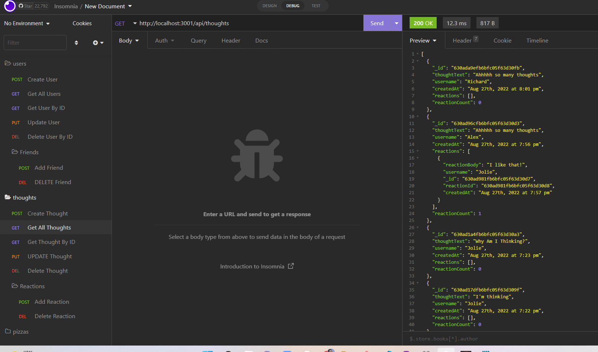

# NoSQL Social Network API

## Table of Contents

- [Description](#description)
- [Technology](#Technology)
- [Installation](#installation)
- [Usage](#usage)
- [Questions](#questions)

## Description:

An API for a social network web application where users can share their thoughts, react to friends’ thoughts, and create a friend list. 
I used Express.js for routing, a MongoDB database, and the Mongoose ODM. In addition to using the Express.js and Mongoose packages, I also used a JavaScript date library of your choice or the native JavaScript Date object to format timestamps.

## Technology:

Project is created with:

- Javascript
- Node.js
- Express.js
- MongoDB
- Mongoose

## Installation

To run this project, install it locally using "npm install"

## Usage

After installing npm packages, the application will be invoked by using the command "npm start"

#### Walkthrough Video

[Walkthough Video Link](https://drive.google.com/file/d/1LD_OiSM4aBL6kBBZD7zyKiTk11BB-Bee/view)

#### Insomnia Screenshot

## Questions?

Please feel free to contact me at anukazan@gmail.com if you need any further information, or my Github at github.com/AnukaZan.
